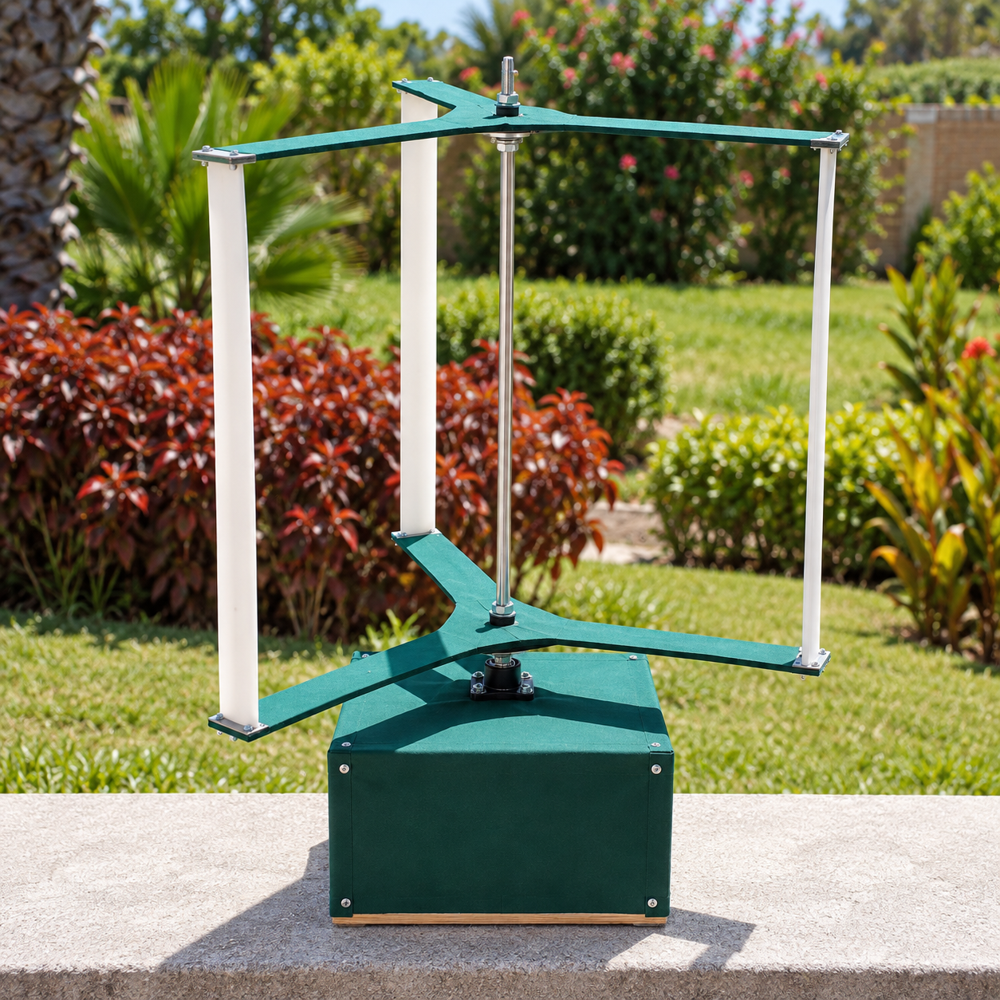

# 🌬️ Vertical Axis Wind Turbine (VAWT) — Graduation Project I

**Year:** 2024  
**Program:** Mechatronics Engineering  
**University:** Mansoura University  
**Main Tools:** QBlade, SolidWorks, AirfoilTools  
**Project Type:** Graduation Project I  

This project investigates the **design, aerodynamic analysis, simulation, and prototyping of a Vertical Axis Wind Turbine (VAWT)**.

The work combines a theoretical comparison between **Horizontal Axis Wind Turbines (HAWTs)** and **Vertical Axis Wind Turbines (VAWTs)** with airfoil selection, QBlade simulation studies, CAD design, manufacturing preparation, and construction of a physical VAWT prototype.

The final prototype was developed after comparing several NACA airfoils and evaluating turbine performance using **QBlade**.


---

## 📸 VAWT Prototype

<p align="center">
  
</p>

The image above shows the fabricated **Vertical Axis Wind Turbine prototype** developed during the project.


---

## 🎯 Project Objectives

The project focuses on:

- studying the differences between **HAWT** and **VAWT** systems
- investigating aerodynamic parameters affecting wind-turbine performance
- comparing different **NACA airfoils**
- studying lift, drag, glide ratio, Reynolds number, tip-speed ratio, and power coefficient
- creating HAWT and VAWT case studies in **QBlade**
- selecting a suitable airfoil for the final VAWT prototype
- designing prototype components in **SolidWorks**
- preparing **DXF files** for manufacturing / laser cutting
- constructing and testing a physical VAWT prototype

---

## 🌀 HAWT Study

The HAWT case study compares four NACA airfoils:

- **NACA 1408**
- **NACA 2412**
- **NACA 6409**
- **NACA 6412**

For each airfoil, the project studies parameters such as:

- blade chord distribution
- twist angle
- Reynolds number
- tip-speed ratio
- lift coefficient
- angle of attack

The calculated blade geometry was then implemented and evaluated in **QBlade**.

### HAWT Study Files

```text
HAWT/
├── NACA 1408 HAWT V1.1.qpr
├── NACA 1408 HAWT V1.1.xlsx
├── NACA 2412 HAWT V1.1.qpr
├── NACA 2412 HAWT V1.1.xlsx
├── NACA 6409 HAWT V1.1.qpr
├── NACA 6409 HAWT V1.1.xlsx
├── NACA 6412 HAWT V1.1.qpr
└── NACA 6412 HAWT V1.1.xlsx
```

---

## 🏙️ VAWT Study

The main VAWT airfoil comparison documented in the graduation project focuses on:

- **NACA 0012**
- **NACA 0015**
- **NACA 0018**
- **NACA 0020**

The airfoils were compared using aerodynamic characteristics including:

- lift coefficient
- drag coefficient
- glide ratio
- power coefficient
- angle of attack behavior

Based on the simulation results, **NACA 0018** was selected as the most suitable airfoil for the chosen VAWT geometry.

Additional QBlade trials and airfoil studies are also included in the repository.

---

## ⚙️ Final VAWT Design

The final prototype parameters documented in the project are:

| Parameter | Value |
|---|---:|
| Solidity | 0.8 |
| Reynolds Number | 64,000 |
| Tip-Speed Ratio | 4 |
| Swept Area | 0.3 m² |
| Number of Blades | 3 |
| Average Wind Velocity | 10 m/s |
| Aspect Ratio | 1 |
| Power Coefficient | 0.485 |
| Estimated Power | 40 W |

### Prototype Geometry

| Height | Chord | Radius | Circ. Angle |
|---:|---:|---:|---:|
| 0 m | 0.3 m | 0.3 m | 0° |
| 0.5 m | 0.3 m | 0.3 m | 0° |

The final turbine uses a **three-blade vertical-axis configuration** built around a central vertical shaft.

---

## 🧪 QBlade

**QBlade** was used as the main aerodynamic simulation tool for the project.

It was used for:

- airfoil analysis
- lift and drag evaluation
- blade geometry definition
- HAWT and VAWT modeling
- power-coefficient analysis
- tip-speed-ratio studies
- aerodynamic turbine simulation
- wake visualization

QBlade project files are stored in the `HAWT/` and `VAWT/` folders.

---

## ✈️ Airfoil Data

Airfoil geometry and aerodynamic data were researched using **AirfoilTools**.

🔗 **AirfoilTools:** http://www.airfoiltools.com/

The repository also includes saved airfoil-reference material used during the project, including XFOIL polar data for selected profiles.

---

## 🧱 SolidWorks Design

The prototype components and trial parts were modeled in **SolidWorks**.

The CAD files include parts used for:

- turbine supports
- hub / rotor components
- blade mounting
- structural elements
- manufacturing trials

These files are stored in:

```text
Solidworks/
```

The SolidWorks geometry was also used as the basis for producing manufacturing-ready DXF files.

---

## 🏭 DXF Manufacturing Files

The `DXF/` folder contains 2D manufacturing profiles exported from the CAD designs.

```text
DXF/
├── c base.DXF
├── ci.DXF
├── hmm.DXF
├── hub new.DXF
├── Part1.DXF
└── turbine_6mm_wood.DXF
```

These files were prepared for fabrication processes such as **laser cutting / profile cutting**.

---

## 📚 Project Documentation

Two main documents explain the project:

### Graduation Project Book

```text
Graduation Project 1 Book.docx
```

The book contains:

- project description
- aerodynamic theory
- wind-turbine design parameters
- airfoil-selection criteria
- HAWT case studies
- VAWT case studies
- QBlade analysis
- prototype design
- SolidWorks design
- prototype construction
- cost analysis

### HAWT vs. VAWT Presentation

```text
HAWTs vs. VAWTs Scientific Analysis.pptx
```

The presentation summarizes:

- HAWT vs. VAWT differences
- axis of rotation
- wind-direction requirements
- efficiency
- starting wind speed
- design complexity
- materials
- operating principles
- QBlade capabilities

### Prototype Image

```text
Pics/VAWT_Prototype.png
```

This image can be added to the repository to visually document the final fabricated VAWT prototype.

---

## 📁 Repository Structure

```text
Vertical-Axis-Wind-Turbine-Graduation-Project/
│
├── README.md
├── Graduation Project 1 Book.docx
├── HAWTs vs. VAWTs Scientific Analysis.pptx
├── Airfoil Tools.html
│
├── Pics/
│   └── VAWT_Prototype.png
│
├── HAWT/
│   ├── NACA 1408 HAWT V1.1.qpr
│   ├── NACA 1408 HAWT V1.1.xlsx
│   ├── NACA 2412 HAWT V1.1.qpr
│   ├── NACA 2412 HAWT V1.1.xlsx
│   ├── NACA 6409 HAWT V1.1.qpr
│   ├── NACA 6409 HAWT V1.1.xlsx
│   ├── NACA 6412 HAWT V1.1.qpr
│   └── NACA 6412 HAWT V1.1.xlsx
│
├── VAWT/
│   ├── NACA 0012 VAWT.qpr
│   ├── NACA 0012 VAWT.stl
│   ├── NACA 0015 VAWT.qpr
│   ├── NACA 0015 VAWT.stl
│   ├── NACA 0018 VAWT V1.0.qpr
│   ├── NACA 0018 VAWT V1.1.qpr
│   ├── NACA 0018 VAWT 25cm.stl
│   ├── NACA 0018 VAWT 50cm.stl
│   ├── NACA 0020 VAWT.qpr
│   ├── NACA 0020 VAWT.stl
│   ├── NACA 2412 VAWT.qpr
│   └── NACA 4415 VAWT.qpr
│
├── Solidworks/
│   ├── cc.SLDPRT
│   ├── ci.SLDPRT
│   ├── hmm.SLDPRT
│   ├── HUB.SLDPRT
│   ├── Part3.SLDPRT
│   └── Part5.SLDPRT
│
└── DXF/
    ├── c base.DXF
    ├── ci.DXF
    ├── hmm.DXF
    ├── hub new.DXF
    ├── Part1.DXF
    └── turbine_6mm_wood.DXF
```

---

## 🧠 What This Project Demonstrates

- wind-turbine aerodynamic analysis
- HAWT vs. VAWT comparison
- airfoil selection
- NACA airfoil evaluation
- QBlade simulation
- lift / drag analysis
- power-coefficient analysis
- tip-speed-ratio analysis
- blade geometry optimization
- SolidWorks CAD modeling
- DXF manufacturing preparation
- prototype development
- engineering documentation

---

## 📌 Project Information

**Project:** Vertical Axis Wind Turbine  
**Type:** Graduation Project I  
**Year:** 2024  
**Program:** Mechatronics Engineering  
**University:** Mansoura University  

**Supervisors:**

- Asst. Prof. Yahia M. Fouda
- Eng. Ahmed Elwan

> Graduation project combining aerodynamic analysis, QBlade simulation, CAD design, manufacturing preparation, and physical prototyping of a small-scale Vertical Axis Wind Turbine.
